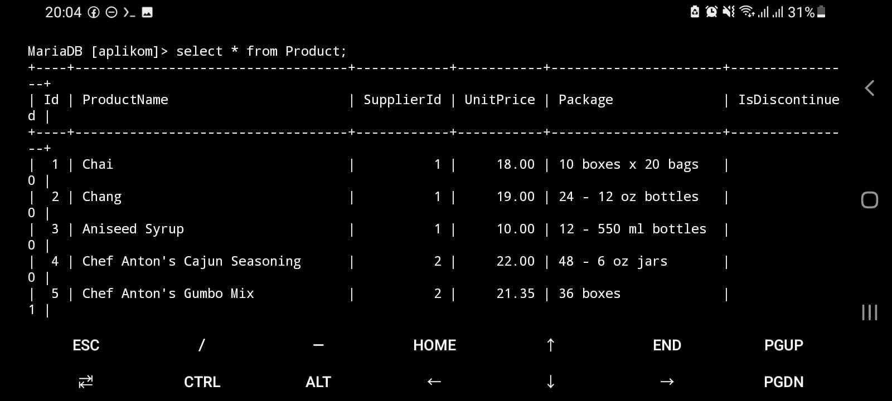

# Aplikom APD B Semester 122

Ini repositori sebenernya hasil iseng-iseng, soalnya pembelajaran SQL di kampus itu pake MSSQL namun akhirnya jadwal bentrok sama SNBT/UTBK yang mengakibatkan lab komputer lantai 3 SFD tower B itu ga bisa dipake buat matkul ini. Ternyata setelah dicoba, ternyata bisa dijalankan di termux dengan database `mariadb`, masih satu famili SQL.


Nah, pada dokumen ini akan dijelaskan bagaimana caranya menginstall termux, mariadb, dan cara setup database dari awal.

> Untuk catatan pembelajaran, tetap disimpan pada [gist ini](https://gist.github.com/reacto11mecha/c09f5a30d04c908c143901cf2f5c8411).

## Download dan Install Termux

Jangan download termux dari playstore, tapi download dari link https://f-droid.org/repo/com.termux_1021.apk, karena alasan [berikut ini](https://github.com/termux-play-store#background).

Kalau sudah terdownload, langsung install aja. Kalo gagal ke install bisa jadi hape elu kepenuhan.

## Install Git dan MariaDB

1. Update semua package

Pertama-tama, update dulu semua package dan dependensi yang ada biar pada saat install database ga ada versi yang usang.

```sh
apt update && apt upgrade -y
```

2. Install Git dan MariaDB

Jalankan perintah berikut ini.

```sh
apt install git wget openssh mariadb
```

3. Clone Repositori Ini

Jadi elu ngeclone repositori ini biar nanti dapat file sql yang sama kayak `sample-model.sql` dan `sample-data.sql` yang dikasih sama pak rayi. Jalankan perintah berikut

```sh
git clone https://github.com/reacto11mecha/aplikom-apdb-122.git
```

4. Jalankan MariaDB

Misalkan elu punya motor, supaya motor elu bisa dipake ya di starter dulu kan, nah proses ini tu kurang lebih sama. Nyalain dulu databasenya biar bisa dipake. Jalankan perintah berikut ini.

```sh
mariadbd-safe -u root &
```

Nanti bakalan muncul banyak teks, nah bersihin aja pake perintah ini.

```sh
clear
```

5. Bikin database baru

Sebelum bikin database baru, masuk dulu ke folder yang namanya `aplikom-apdb-122`. Caranya kayak begini.

```sh
cd aplikom-apdb-122
```

Nanti tampilannya kurleb kek gini.


Nah kalo udah kek gitu, saatnya bikin databasenya. Login dulu ke databasenya, sama kayak pada saat elu make management studio, cuman yang ini bentuknya teks.

```sh
mariadb -u root
```

Dalam contoh ini gw bikin nama databasenya `aplikom` biar ga kepanjangan. Lakukan perintah ini kalo udah muncul tulisan ini di paling akhir.

```
MariaDB [(none)] >
```

Nah kalo udah begitu, bikin dah databasenya.

```sh
create database aplikom;
```

Kalo dapet balasan `Query OK, 1 row affected` berarti udah kebuat.


6. Memasukan Model dan Data

Sekarang jalanin `exit` supaya keluar dulu dari databasenya. Abis tu jalanin perintah ini

```
mariadb -u root aplikom < mysql-mariadb-sample-model.sql
mariadb -u root aplikom < mysql-mariadb-sample-data.sql
```

Ga akan ada responnya, tapi itu bertanda querynya ke eksekusi semua. Pada saat menjalankan perintah input `sample-data` emang agak lama karena memang datanya banyak.


7. Belajar Query

Kalo step diatas udah oke, sekarang elu bisa lanjut belajar sql di hape lu sendiri. Masuk lagi ke mariadb.

```sh
mariadb -u root
```

Tunggu sampe keluar teks ini

```
MariaDB [(none)] >
```

Kalo udah, saatnya masuk ke database `aplikom` yang udah ada datanya.

```sh
use aplikom;
```

Semisal elu mau ngecek apa aja tabel yang ada

```sh
show tables;
```


Misal ini query dasar buat baca tabel `Product`.

```sql
select * from Product;
```



## Post Installation

Nah kalo tahap instalasi dan pengetesan udah, lu bisa make langsung buat belajar. Nyalain dulu databasenya, masuk ke mariadb, terus pilih database `aplikom`.

```sh
mariadbd-safe -u root &

clear

mariadb -u root

use aplikom
```

Nah, bisa lanjut dah.

## Catatan Penting

Ada perbedaan antara query MSSQL dan MariaDB/MySQL yaitu penggunaan wajib titik koma (;) pada setiap statement query perlu di eksekusi. Terus juga kurung siku `[]` itu diganti dengan )_backtick_ (\`\`). Itu aja sih.

## Pranala Lain

- https://www.geeksforgeeks.org/how-to-install-git-on-termux/
- https://wiki.termux.com/wiki/MariaDB
- https://1drv.ms/f/s!Ag3qP3gg8MLQi6p8TcwIbYLCQYXcbw?e=0IAdxh
